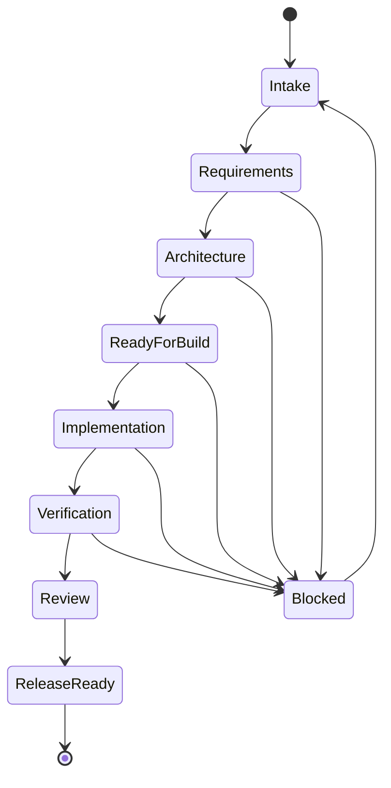

# Multi-Agent Coordination

Use this workflow when one GitHub story needs more than one agent.

The goal is not to create one large autonomous agent. The goal is to keep each agent narrow, auditable, and easy to review.

## Activation Rule

Start from a GitHub story. If the story is non-trivial, the Orchestrator Agent creates scoped agent tasks before implementation starts.

Before any agent edits files, the agent must complete the project and branch start checklist:

1. Identify the GitHub story that owns the work.
2. Confirm the story has a `Parent Epic` section unless the issue itself is an epic.
3. Confirm the story is in GitHub Project 1: `https://github.com/users/radhikari89/projects/1`.
4. Set the Project Status to `In Progress`.
5. Create or switch to a branch that follows [Branch Naming](branch-naming.md).
6. Add an issue comment naming the active agent, Project Status, branch, and scope.

If a story is missing a parent epic, add the parent epic before starting work. If a story is missing from Project 1, add it before starting work. If a branch already exists but does not follow the naming convention, either rename it before pushing or document why it is being kept, such as an existing open PR with reviewer context.

Each task must define:

- parent issue
- assigned agent
- objective
- inputs
- outputs
- dependencies
- write scope
- status
- blocking questions

## Default Sequence

1. Product Analyst clarifies user value, scope, and acceptance criteria.
2. Solution Architect defines app boundaries, contracts, risks, and sequencing.
3. Orchestrator breaks the story into scoped tasks.
4. Backend, UI, DevOps, QA, and Security tasks run in parallel only when their dependencies and write scopes allow it.
5. QA verifies the integrated behavior.
6. Orchestrator prepares PR context and release handoff notes.

## Project Board Sync

GitHub issue labels and GitHub Project Status are separate. A `status:*` label helps with routing, but it does not move the card on the project board.

Use this Project Status mapping:

| Work State | Project Status | Label Guidance |
| --- | --- | --- |
| New idea or unprioritized work | `Backlog` | Use the relevant `type:*`, `agent:*`, and `area:*` labels. |
| Ready for an agent but not started | `Ready` | Use `status:needs-product`, `status:ready-for-architecture`, or `status:ready-for-build` as appropriate. |
| Agent is actively working | `In Progress` | Comment with active agent, branch, and scope. |
| Pull request or owner review is needed | `Review` | Link the PR and summarize verification. |
| Verification is active | `Testing` | Use when QA or deployed smoke testing is the current blocker. |
| Work is completed or merged | `Done` | Close the issue or comment why it remains open. |
| Work cannot proceed | `Blocked` when available; otherwise leave current status and add a blocking comment | Add `status:blocked` and state the decision needed. |

Minimum sync points:

- Start work: add to Project 1 and set `In Progress`.
- Open PR or request review: set `Review`.
- Start QA-only validation: set `Testing`.
- Complete merged work: set `Done`.
- Hit a blocker: add `status:blocked` and comment with the blocker.

If the GitHub CLI or permissions cannot update Project Status, the agent must say so in the issue comment and final handoff.

## Parallel Work

Agents can run in parallel when:

- dependencies are satisfied
- write scopes do not overlap
- an agreed contract exists for shared boundaries
- one integration owner is named if shared files must change

If write scopes overlap, serialize the tasks or assign one integration owner.

## Default Write Scopes

| Agent | Default Write Scope |
| --- | --- |
| Product Analyst | `docs/ai-agents/staging/**`, feature/story docs |
| Solution Architect | `docs/architecture/**`, architecture sections of feature docs, API contract docs |
| Backend Agent | `services/userservice/**`, backend API docs, database migrations |
| UI Agent | `ui/**`, UI docs |
| DevOps Agent | `devops/**`, `.github/workflows/**`, deployment docs |
| QA Agent | test plans, verification reports, test harnesses |
| Security Reviewer | security review docs, comments, policy recommendations |
| Release Manager | release notes, deployment checklist, rollback notes |

## Handoff Contracts

Product to Architecture:

```yaml
story:
  title:
  actor:
  goal:
  reason:
acceptance_criteria:
  - id:
    description:
constraints:
  - type:
    detail:
open_questions:
  - question:
    owner:
```

Architecture to Builders:

```yaml
technical_plan:
  summary:
  app_boundary:
    type:
    reason:
  backend:
    endpoints:
      - method:
        path:
        request:
        response:
        errors:
  frontend:
    routes:
      - path:
        purpose:
  infrastructure:
    changes:
      - item:
        reason:
  risks:
    - risk:
      mitigation:
```

Builders to Reviewers:

```yaml
implementation_summary:
  files_changed:
    - path:
      reason:
  tests_added:
    - name:
      command:
  manual_verification:
    - step:
      result:
  known_gaps:
    - gap:
      follow_up:
  tracking:
    issue:
    branch:
    pull_request:
    project_status:
```

## Feature Doc Updates

Feature docs live under `docs/features/` and should be treated as the current-state record for product features.

Agent tasks should include the relevant feature doc in `Inputs` when the work affects a feature. Pull requests should update that feature doc when they change:

- status
- completed work
- remaining work
- decisions
- open questions
- app boundary
- architecture or diagrams
- verification steps

## Status Flow



Rendered image:



## Label Usage

Use labels to communicate routing and state:

- `agent:*` labels identify the next specialist agent.
- `area:*` labels identify the affected system area.
- `risk:*` labels identify cross-cutting review concerns.
- `status:*` labels identify current workflow state.
- `type:*` labels identify issue shape.

The canonical label definitions live in `.github/labels.yml`.

## Label Maintenance

The existing repository labels should not be churned just to match a new naming style. Keep them when they already carry useful history.

Recommended pattern:

- Use `type:*` labels for new issue shape classification.
- Keep existing labels such as `Epic`, `Feature`, `Task`, and `Tech Debt` until there is a deliberate cleanup story.
- Use `area:*` labels for new routing, while allowing existing labels such as `AWS`, `API`, `SPRING BOOT`, `ui`, `Database`, and `SECURITY` to remain as legacy or human-friendly tags.
- Use `agent:*` labels to indicate the next specialist agent.
- Use `status:*` labels to show workflow state.

Do not delete or rename existing labels without an explicit story because older issues may depend on them.

## Branch Enforcement

Branches must follow [Branch Naming](branch-naming.md). The branch name should be recorded in the issue activation comment.

For example:

```text
Agent active on this story.

Project Status: In Progress
Branch: docs/56-project-board-branch-sync
Scope: update agent workflow docs for project-board sync and branch naming enforcement.
```

If a task is split across multiple agents, each agent should use a branch scoped to the parent story and task focus, such as `task/56-docs-workflow-rules` or `task/56-project-sync-script`.
