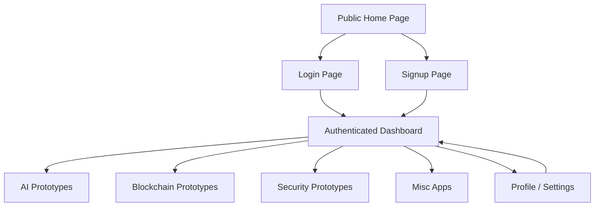

# Workflow Wireframe Draft

Status: Draft

Related story: [#40](https://github.com/radhikari89/codex-demo/issues/40)

## Purpose

Define the first product workflow for `webdevisfun.com` before UI implementation stories are created.

This draft stays repo-native so it can be reviewed in a normal pull request. Figma can be added later if visual polish, layout fidelity, or stakeholder presentation becomes important.

## Wireframe Tool Recommendation

Use **Mermaid and Markdown first**, then add Figma only after the owner approves the product workflow.

Why:

- The product direction is still being shaped.
- Mermaid diagrams are easy for AI agents to update in PRs.
- The current need is workflow approval, not high-fidelity visual design.
- Figma becomes valuable once the app shell, dashboard content, and navigation model are stable enough to design visually.

## Primary User Flow

Rendered image:

## Route Model

| Route | Access | Purpose |
| --- | --- | --- |
| `/` | Public | Explain the prototypes hub and route visitors to login/signup. |
| `/login` | Public | Existing users authenticate. |
| `/signup` | Public | New users create an account. |
| `/dashboard` | Signed-in | First post-login hub and activity overview. |
| `/apps/ai` | Signed-in | AI app category landing page. |
| `/apps/blockchain` | Signed-in | Blockchain app category landing page. |
| `/apps/security` | Signed-in | Security prototype category landing page for auth provider labs and security experiments. |
| `/apps/misc` | Signed-in | Misc app category landing page, including Work Orders entry when ready. |
| `/settings` | Signed-in | Profile, account, preferences, and future security settings. |

## Public Home Page Draft

Goal: make `webdevisfun.com` feel like a modern learning prototypes hub, not just a generic dashboard demo.

First screen should include:

- Brand/name: `webdevisfun.com`
- Short value statement: modern web app prototypes and experiment hub
- Primary action: log in
- Secondary action: create account
- App category preview: AI, Blockchain, Security, Misc
- Hint that signed-in users get a dashboard and app navigation

Avoid over-explaining future features that are not usable yet. The home page should invite entry into the app shell while keeping the promise honest.

## Auth Entry Draft

Login page:

- Email/password form for the first implementation path.
- Google sign-in area can be designed as a reserved future option until the auth strategy approves it.
- Safe error state for failed login.
- Link to signup.

Signup page:

- Name, email, password.
- Optional future Google sign-up/sign-in entry.
- Safe duplicate account error.
- Link back to login.

Auth pages should not define the provider strategy. They should consume the decision from [Authentication Strategy Discovery](../../architecture/drafts/auth-strategy-discovery.md).

## Dashboard Draft

The dashboard should be the first real app hub after login.

Recommended first dashboard sections:

| Section | Purpose |
| --- | --- |
| Welcome header | Confirms the signed-in user and provides logout/profile access. |
| App category navigation | Prominent entry cards or list for AI, Blockchain, Security, and Misc. |
| Continue / recent activity | Shows recent app activity when real data exists; can start as empty state. |
| Recommended next app | Future AI recommendation area; initially a placeholder or hidden until the AI feature exists. |
| System/status strip | Lightweight indicators for app availability, verification, or setup status. |

The current dashboard demo metrics can be replaced by app-hub content. Metrics should only stay if they represent real user or app activity.

## App Category Landing Draft

Each app category should use the same lightweight structure:

- Category title and short purpose.
- Available apps list.
- Empty state when no apps exist yet.
- App verification/readiness marker when applicable.
- Link back to dashboard.

Initial category behavior:

| Category | First Behavior |
| --- | --- |
| AI | Landing page with future app recommendation concept and empty app list. |
| Blockchain | Landing page with security/tooling discovery notice and empty app list. |
| Security | Landing page for auth provider labs and security experiments; runnable labs stay isolated from the main login flow. |
| Misc | Landing page that can later link or embed Work Orders. |

## Navigation Model

Use a persistent authenticated shell after login:

- Top or side navigation with Dashboard, AI, Blockchain, Security, Misc, Settings.
- User menu with profile/logout.
- Mobile layout should collapse navigation into a compact menu.
- Route guard protects all signed-in routes.

Do not create separate micro-frontends for category pages yet. Keep categories as routes inside the Angular app until an app boundary requires separate deployment.

## Follow-Up UI Story Candidates

1. Rename visible brand copy from `my-app` to `webdevisfun.com`.
2. Replace generic home hero/dashboard copy with prototypes hub positioning.
3. Add authenticated app shell navigation.
4. Add category landing routes for AI, Blockchain, Security, and Misc.
5. Replace dashboard demo metrics with app-hub sections and empty states.
6. Update login/signup screens after auth strategy story `#38` finalizes the provider flow.

## Acceptance Check

- Recommended Mermaid/Markdown first, with Figma deferred.
- Drafted public home page flow.
- Drafted login/signup entry points.
- Drafted authenticated dashboard and navigation model.
- Included AI, Blockchain, Security, and Misc categories.
- Identified the first useful dashboard content.
- Produced follow-up UI implementation story candidates.
