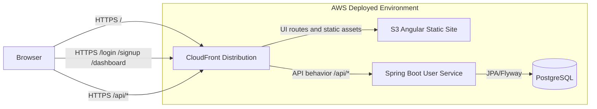

# Container View

This diagram shows the current runtime containers and request routing.

## Responsibilities

| Container | Responsibility | Current Location |
| --- | --- | --- |
| Angular UI | Home, signup, login, dashboard, route guard, local auth state | `ui/` |
| Spring Boot User Service | User REST API, validation, persistence, Swagger/OpenAPI | `services/userservice/` |
| PostgreSQL | User data and future relational app data | `database/postgres/` |
| CloudFront/S3 | Public UI hosting and path-based routing to backend APIs | `devops/` |

## Known Gaps

- Authentication is currently a temporary bridge and should become a real credential-based or provider-backed flow.
- Future app categories need an approved app-boundary model.
- Additional services should be introduced only when a real app boundary justifies them.
