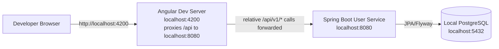
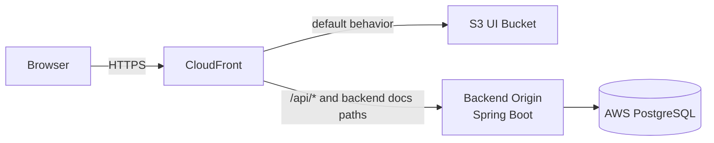

# Deployment View

This document captures local and deployed topology.

## Local Development

Rendered image:

## AWS Deployment

Rendered image:

## Notes

- UI source code should call relative API paths like `/api/v1/users`.
- Local Angular development uses `ui/proxy.conf.json` to forward `/api` to `localhost:8080`.
- Deployed routing uses CloudFront path behaviors to send UI traffic to S3 and backend traffic to the Spring Boot origin.

## Related Docs

- [UI deployment](../../../devops/UI_DEPLOY_README.md)
- [Custom domain path routing](../../../devops/CUSTOM_DOMAIN_PATH_ROUTING.md)
- [Backend EC2 deployment](../../../devops/EC2_README.md)
