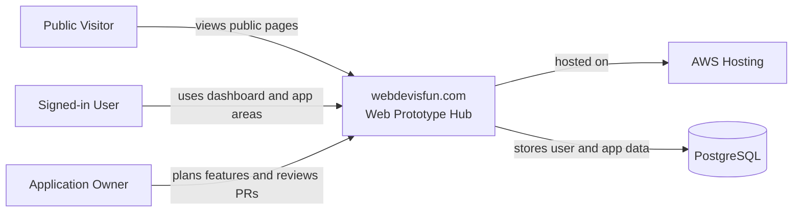

# System Context

This diagram shows the current application at a high level.

Rendered image:

## Notes

- The app is currently a deployed full-stack starter with Angular, Spring Boot, PostgreSQL, and AWS runbooks.
- The product direction is to become a learning playground and app hub for AI, Blockchain, Misc apps, and reusable app templates.
- Future app areas should define their own boundary and verification model.
