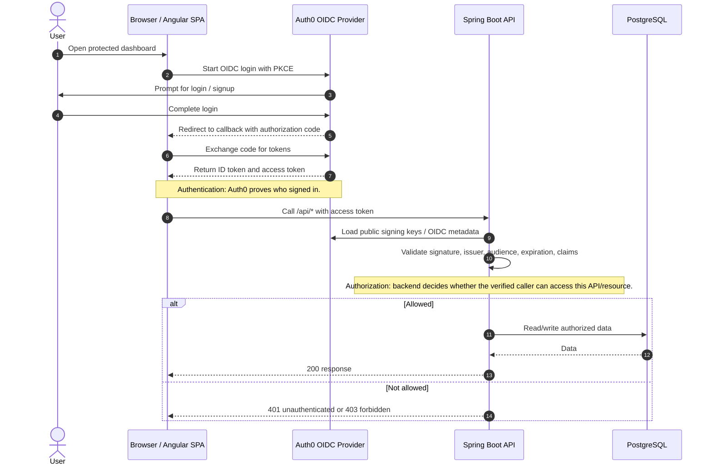
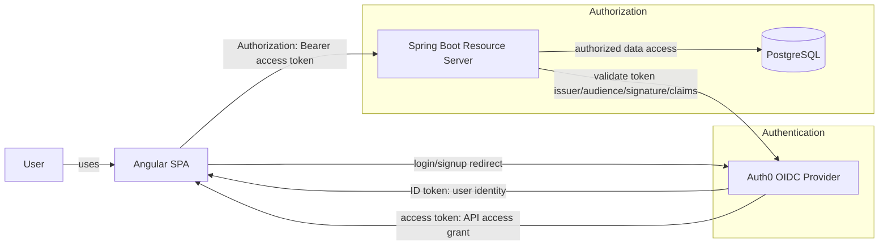

# Authentication and Authorization Flow

Status: Living knowledge note

Related notes:

- [Auth Provider Notes](auth-provider-notes.md)
- [Auth0 OIDC Configuration](auth0-oidc-configuration.md)

## Plain Meaning

- Authentication answers: "Who is this user?"
- Authorization answers: "What is this authenticated user or client allowed to access?"

For the main hub, Auth0 handles login and identity. Spring Boot validates tokens and enforces protected API access.

## Main Hub Flow

## Responsibility Diagram

## Token Roles

| Token | Main Consumer | Purpose |
| --- | --- | --- |
| ID token | Angular SPA | Helps the client know who signed in. |
| Access token | Spring Boot API | Lets the backend verify and authorize protected API calls. |

The backend should not trust the browser simply because the UI says the user is signed in. It should validate the access token on protected API calls and then apply resource-level rules.
