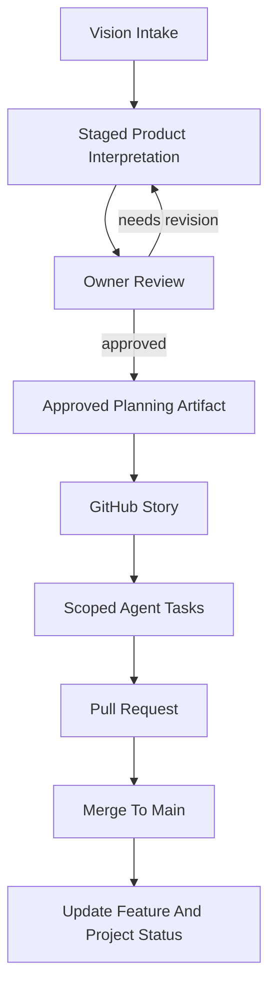

# AI Agent Story Flow

This workflow shows how raw vision becomes approved stories and pull requests.

Rendered image:

## Rules

- Raw vision should be staged before implementation stories are created.
- Non-trivial stories should be decomposed into scoped agent tasks.
- Pull requests should link the GitHub story.
- Feature and project status should be updated after merge.

## Related Docs

- [Vision Intake](../../ai-agents/vision-intake.md)
- [Staging](../../ai-agents/staging/README.md)
- [Multi-Agent Coordination](../../ai-agents/multi-agent-coordination.md)
- [Golden Rules](../../ai-agents/golden-rules.md)
